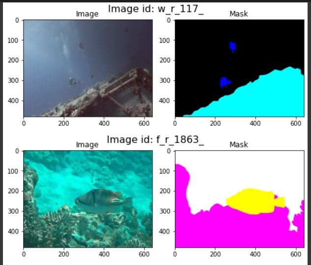
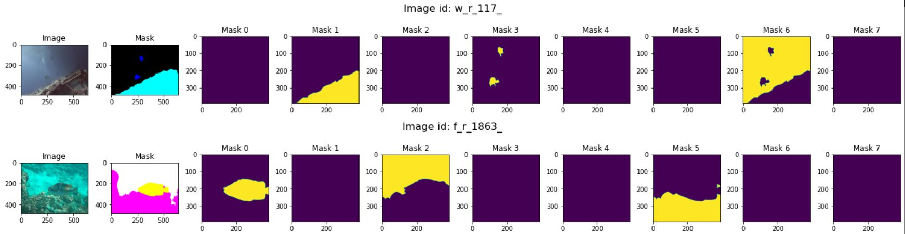
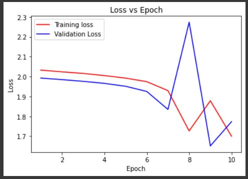
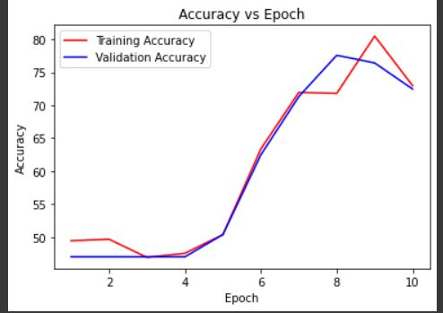

# Multi-Class-Image-Segmentation-

## Implementation of the UNET model
```
https://github.com/maitridas/ModelCluster/tree/main/UNET
```

## Take a look at the dataset
Note:- Any dataset can be used
Please follow this folder structure

```
|-----train_val
|          |-----images
|          |-----masks
|-----UNET\ segmentation.ipynb   
```



## Preprocessing
For the preprocessing step UNET takes output of a shape of 572x572 images so padded the smaller image and cropped the larger image
Also cropped the masks to a shape of 388x388
And as there are 8 classes seperated the rgb masks to 8 different grayscale mask



## Training and Loss

As I don't have access to the harware to train such a large model, I trained the model on 24 training images and validated on 6 images, total of 30 images for 10 epochs 






## Shortcomings

Because I trained on less images, this model might not give accurate images as there will be class imbalance problem
